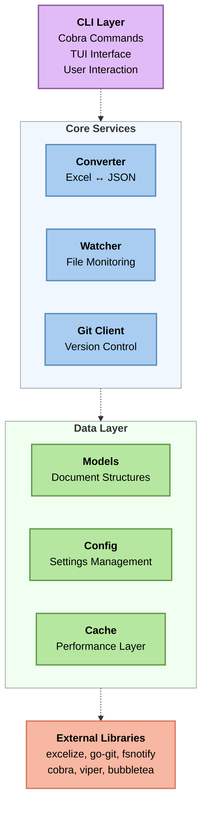
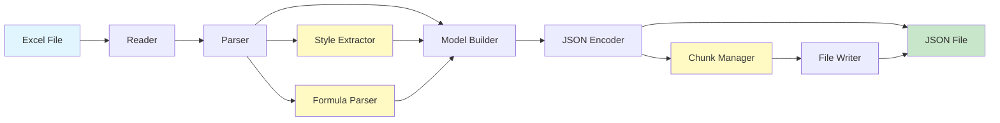
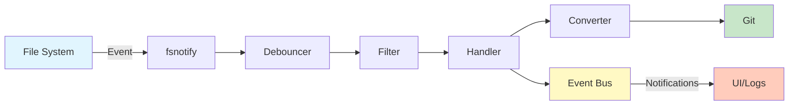

# Architecture

This document describes the architecture and design decisions of GitCells.

## Overview

GitCells follows a modular architecture with clear separation of concerns:



## Directory Structure

```
gitcells/
├── cmd/
│   └── gitcells/         # CLI entry point and commands
│       ├── main.go       # Application entry point
│       ├── init.go       # Init command
│       ├── watch.go      # Watch command
│       ├── convert.go    # Convert command
│       └── ...          # Other commands
├── internal/            # Private application code
│   ├── converter/       # Excel/JSON conversion
│   ├── watcher/         # File system monitoring
│   ├── git/            # Git operations
│   ├── config/         # Configuration management
│   ├── cache/          # Caching layer
│   ├── tui/            # Terminal UI components
│   ├── updater/        # Self-update functionality
│   └── utils/          # Shared utilities
├── pkg/                # Public packages
│   └── models/         # Shared data models
├── test/               # Integration tests
├── scripts/            # Build and utility scripts
└── docs/              # Documentation
```

## Core Components

### CLI Layer (cmd/gitcells)

The CLI layer uses Cobra for command-line parsing and provides:

- Command definitions and flags
- Input validation
- Output formatting
- Error handling and user feedback
- Integration with TUI mode

**Design Decisions:**
- Each command in a separate file for maintainability
- Shared logger instance across commands
- Consistent error handling patterns
- Global flags handled at root level

### Converter Service (internal/converter)

Handles bidirectional conversion between Excel and JSON formats.

**Key Components:**
- `Converter` interface for abstraction
- `excelToJSON` and `jsonToExcel` implementations
- Style extraction and preservation
- Formula handling (A1 and R1C1 notation)
- Chunking support for large files

**Design Patterns:**
- Strategy pattern for chunking strategies
- Builder pattern for complex cell objects
- Observer pattern for progress callbacks

```go
type Converter interface {
    ExcelToJSON(filePath string, options ConvertOptions) (*models.ExcelDocument, error)
    JSONToExcel(doc *models.ExcelDocument, outputPath string, options ConvertOptions) error
}
```

### Watcher Service (internal/watcher)

Monitors file system for Excel file changes.

**Key Components:**
- File system event monitoring using fsnotify
- Debouncing mechanism to group rapid changes
- Pattern matching for file filtering
- Recursive directory watching

**Design Decisions:**
- Event-driven architecture
- Configurable debounce delays
- Ignore patterns using glob matching
- Graceful shutdown handling

```go
type FileWatcher interface {
    Start() error
    Stop() error
    AddDirectory(path string) error
    RemoveDirectory(path string) error
}
```

### Git Client (internal/git)

Integrates with Git repositories for version control.

**Key Components:**
- go-git library wrapper
- Auto-commit functionality
- Branch management
- Remote operations (push/pull)

**Design Patterns:**
- Adapter pattern for go-git library
- Command pattern for Git operations
- Template pattern for commit messages

### Configuration Management (internal/config)

Handles configuration loading and validation.

**Key Features:**
- YAML configuration files
- Environment variable overrides
- Configuration validation
- Default values
- Multiple config file locations

**Design Decisions:**
- Viper for configuration management
- Strongly typed configuration structs
- Fail-fast validation
- Sensible defaults

### Terminal UI (internal/tui)

Interactive terminal interface using Bubble Tea.

**Key Components:**
- Main application model
- Setup wizard flow
- Status dashboard
- Error log viewer
- Settings management

**Architecture:**
- Model-View-Update (MVU) pattern
- Component-based UI structure
- Message passing for state updates
- Keyboard navigation support

### Data Models (pkg/models)

Shared data structures representing Excel documents.

**Key Types:**
- `ExcelDocument` - Root document structure
- `Sheet` - Worksheet representation
- `Cell` - Individual cell data
- `Style` - Formatting information

**Design Principles:**
- JSON serialization tags
- Optional fields using pointers
- Validation methods
- Version compatibility

## Data Flow

### Excel to JSON Conversion



### File Watching Flow



## Concurrency Model

GitCells uses Go's concurrency features:

1. **Worker Pool**: For parallel file conversion
2. **Event Channels**: For file system events
3. **Context Cancellation**: For graceful shutdown
4. **Mutex Protection**: For shared state

```go
// Worker pool example
type WorkerPool struct {
    workers   int
    jobQueue  chan Job
    wg        sync.WaitGroup
}
```

## Error Handling

Consistent error handling throughout:

1. **Wrapped Errors**: Using `fmt.Errorf` with `%w`
2. **Error Types**: Custom errors for specific conditions
3. **Logging**: Structured logging with context
4. **User Messages**: Clear, actionable error messages

```go
var (
    ErrUnsupportedFormat = errors.New("unsupported file format")
    ErrFileLocked       = errors.New("file is locked by another process")
    ErrChecksumMismatch = errors.New("file checksum mismatch")
)
```

## Performance Considerations

### Memory Management

- Streaming for large files
- Chunking to limit memory usage
- Garbage collection tuning
- Resource pooling

### Optimization Strategies

1. **Lazy Loading**: Load sheet data on demand
2. **Caching**: Cache converted files
3. **Parallel Processing**: Use multiple workers
4. **Debouncing**: Reduce redundant operations

## Security Considerations

### Input Validation

- Path traversal prevention
- File type validation
- Size limits enforcement
- Formula injection prevention

### Git Security

- Credential management
- SSH key support
- GPG signing capability
- Sensitive data exclusion

## Extension Points

### Plugin Architecture (Future)

```go
type Plugin interface {
    Name() string
    Version() string
    Initialize(config map[string]interface{}) error
    Process(doc *models.ExcelDocument) error
}
```

### Custom Converters

```go
type CustomConverter interface {
    Converter
    RegisterHandler(ext string, handler FileHandler)
}
```

## Testing Strategy

### Unit Tests

- Component isolation
- Mock dependencies
- Table-driven tests
- Property-based testing

### Integration Tests

- End-to-end workflows
- Real file operations
- Git integration
- Performance benchmarks

## Build and Deployment

### Build Process

1. Multi-platform compilation
2. Binary signing
3. Compression
4. Update manifest generation

### Release Process

1. Semantic versioning
2. GitHub releases
3. Checksums generation
4. Update server notification

## Future Architecture Considerations

### Planned Enhancements

1. **Plugin System**: For custom processors
2. **Web Interface**: Browser-based UI
3. **Cloud Sync**: Remote storage support
4. **API Server**: REST/GraphQL endpoint
5. **Distributed Processing**: For large deployments

### Scalability

- Horizontal scaling for processing
- Database backend for metadata
- Message queue for job distribution
- Container orchestration support

## Design Principles

1. **Simplicity**: Easy to understand and use
2. **Modularity**: Clear component boundaries
3. **Extensibility**: Easy to add features
4. **Performance**: Efficient resource usage
5. **Reliability**: Robust error handling
6. **Security**: Safe by default

## Next Steps

- Review [Contributing Guide](contributing.md) to help improve the architecture
- See [Building Guide](building.md) for development setup
- Check [Testing Guide](testing.md) for quality assurance
- Read [API Reference](../reference/api.md) for implementation details